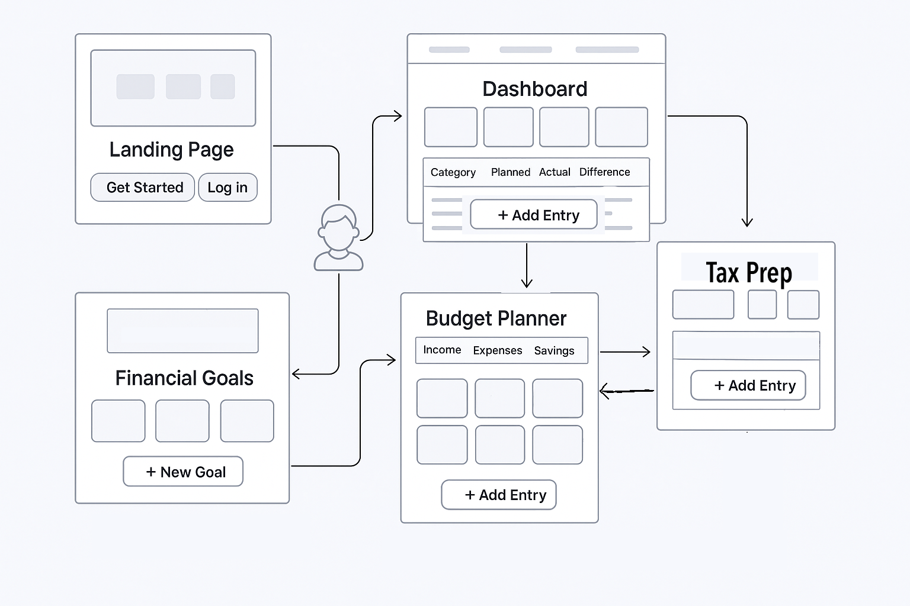

# PennyPilot

PennyPilot is a gamified financial planning web application designed to help users build better budgeting habits, track spending, and visualize savings goals. By integrating bank data via the Plaid API, users can link their accounts and automatically populate budget tables and charts. The app uses a combination of interactive visuals, progress tracking, and financial education tools to engage users and support long-term financial health.

---

## Table of Contents
- [models.py](#modelspy)
- [schemas.py](#schemaspy)
- [key_utils.py](#key_utilspy)
- [config.py](#configpy)
- [base.py](#basepy)
- [app.py](#apppy)
- [setup_cred.py](#setup_credpy)
- [plaid_client_config.py](#plaid_client_configpy)
- [init_keys_table.py](#init_keys_tablepy)
- [jared_mock_data.py](#jared_mock_datapy)
- [user.py](#userpy)
- [transaction.py](#transactionpy)
- [tax_info.py](#tax_infopy)
- [savings.py](#savingspy)

---

## 🚀 Setup & Installation Guide

Follow these steps to get the project running locally for development or testing.

### Prerequisites

- Node.js (v18 or above)
- Python 3.10+
- MySQL or PostgreSQL
- Virtual environment tool (e.g. `venv` or `virtualenv`)
- Plaid API keys
- AWS EC2 instance (for deployment)

---

### 1. Clone the Repository

```bash
git clone https://github.com/your-org/pennypilot.git
```
### 2. Frontend Setup (React)
``` bash
cd pennypilot
npm install
npm run dev
```
### 3. Backend Setup (Flask + SQLAlchemy)
``` bash
cd backend
python -m venv venv
source venv/bin/activate  # On Windows use `venv\Scripts\activate`
pip install -r requirements.txt
```
Environment Variables & Secrets

To run this project locally or in a deployment environment, you will need access to environment variables for services such as Plaid, Firebase, and the database connection.

We’ve provided a `.env.example` file in the root directory.
To get started:

1. Copy the `.env.example` file to create your local `.env` file
2. Fill in the actual values by referencing project secrets stored in GitHub Secrets.
    - This project uses GitHub Actions for CI/CD. Sensitive keys are stored securely in GitHub Secrets, which are automatically injected during build and deployment workflows.
    - To request access:

Contact a project maintainer
Access is granted only to trusted collaborators with write/admin permissions

Once granted, secrets such as the following will be available in the Actions environment:

PLAID_CLIENT_ID

PLAID_SECRET

FIREBASE_API_KEY

DATABASE_URL

SECRET_KEY

These are not available to local development automatically. You must retrieve them securely and insert them manually into your local .env files using the .env.example template as a guide.


Run the backend server:
``` bash
flask run
```
### 4. Database Initialization
Ensure your local MySQL/PostgreSQL server is running.
``` bash
flask db init
flask db migrate
flask db upgrade
```
### 5. Deploying to AWS EC2
- see guide through this link: https://docs.aws.amazon.com/codedeploy/latest/userguide/deployment-steps-server.html

### Project Overview
- Link your bank accounts securely via Plaid

- Automatically categorize transactions into income, expenses, and savings

- Visualize your budget breakdown and progress

- Earn rewards and achievements for meeting goals

- Securely authenticate via Firebase

### Screenshots and Diagrams
## PennyPilot Wireframe

*Basic Wireframe of PennyPilot Layout*

*Original idea of Dashboard*

*Peter Pilot in elite pilot skins*


### Team Structure

Frontend

- Built with React, styled using Material UI

- State management: Redux Toolkit + React Query

- Authentication via Firebase Auth

Responsibilities:

- UI design and responsiveness

- Budget table & chart rendering

- Plaid Link integration on client side

Backend

- Developed using Flask and SQLAlchemy

- Implements a secure RESTful API

- Handles Plaid token exchanges and transaction storage

- Manages budget logic and database interaction

Responsibilities:

- Secure token handling and API routing

- Data transformation and storage

- Database migrations


# Frontend Documentation
---
## Overview

The PennyPilot frontend is built with React and Material-UI, featuring a modern, responsive design with interactive visualizations and a gamified user experience. The application uses Firebase for authentication and integrates with Plaid for bank account connectivity.

## Tech Stack

- **Framework**: React 18+
- **UI Library**: Material-UI (MUI)
- **State Management**: React Context + Local Storage
- **Authentication**: Firebase Auth
- **Banking Integration**: Plaid Link
- **Charts**: Recharts
- **Animations**: Framer Motion
- **Routing**: React Router v6

## Core Components

### Navigation & Layout
- `Navbar.tsx`: Responsive navigation bar with mobile drawer
- `Footer.tsx`: Site-wide footer with team information and quick links
- `PilotAvatar.tsx`: Animated pilot character with speech bubble

### Authentication
- `LoginModal.tsx`: Handles user authentication with email/password
  - Form validation
  - Error handling
  - Secure password requirements
  - Firebase integration

### Main Features

#### Dashboard (`Dashboard.tsx`)
- Budget overview with interactive charts
- Financial goals tracking
- Bank account integration
- Recent transactions display
- Achievement badges system

#### Budget Management (`BudgetSummaryChart.tsx`)
- Interactive pie charts for income/expenses
- Budget creation and management
- Real-time updates
- Multiple budget support

#### Goals System (`Goals.tsx`)
- Goal creation and tracking
- Progress visualization
- Achievement badges
- Local storage persistence
- Backup/restore functionality

#### Tax Preparation (`TaxPrep.tsx`)
- Deductible expense tracking
- Category-based organization
- Export functionality (PDF, Word)
- Data visualization
- Sorting and filtering

## Component Architecture

### State Management
- Uses React Context for global state
- Local storage for persistence
- Firebase for user data
- Plaid for financial data

### Data Flow
1. User authentication via Firebase
2. Bank account linking through Plaid
3. Transaction data processing
4. Local storage for offline capability
5. Real-time updates when online

## UI/UX Features

### Responsive Design
- Mobile-first approach
- Breakpoint-based layouts
- Adaptive components
- Touch-friendly interfaces

### Animations
- Page transitions
- Loading states
- Interactive charts
- Achievement celebrations

### Theme System
- Custom Material-UI theme
- Consistent color palette
- Dark/light mode support
- Accessible contrast ratios

## Security Features

- Secure authentication flow
- Protected routes
- API key management
- Data encryption
- Secure token handling

## Performance Optimizations

- Code splitting
- Lazy loading
- Memoization
- Optimized re-renders
- Efficient data caching

## Development Guidelines

### Component Structure
```typescript
// Example component structure
interface ComponentProps {
  // Props interface
}

const Component: React.FC<ComponentProps> = ({ props }) => {
  // State management
  // Event handlers
  // Render logic
};
```

### Styling Conventions
- Material-UI's `sx` prop for component-specific styles
- Theme-based styling
- Responsive design patterns
- Consistent spacing and typography

### Best Practices
- TypeScript for type safety
- Component composition
- Error boundaries
- Loading states
- Error handling

## Testing

- Unit tests for components
- Integration tests for features
- End-to-end testing
- Accessibility testing

## Deployment

- Build optimization
- Environment configuration
- CI/CD pipeline integration
- Performance monitoring

## Contributing

### Frontend Development Workflow
1. Create feature branch
2. Implement changes
3. Add tests
4. Submit PR
5. Code review
6. Merge to main

### Code Style
- ESLint configuration
- Prettier formatting
- TypeScript strict mode
- Component documentation

## Future Enhancements

- Enhanced mobile experience
- Additional chart types
- More gamification features
- Advanced budget analytics
- Custom theme support


## Backend Documentation
---
## `models.py`
Defines the ORM models for the app using SQLAlchemy. Includes tables for Users, Linked Accounts, Transactions, Goals, Tax Info, Income, Expenses, Savings, Budget, and Access Tokens.
**Key points:**
- Uses SQLAlchemy declarative models linked with Flask app.
- Defines relationships between `User` and `LinkedAccount`.
- Each class corresponds to a database table with appropriate columns and data types.
- Automatically creates tables on app context.
---
## `schemas.py`
Marshmallow schemas for serialization and validation of API input/output data.
- Each schema corresponds to a model and defines required fields and validation.
- Includes schemas for User, LinkedAccount, Transaction, Goal, TaxInfo, Income, Expenses, Savings, Budget, and AccessToken.
- Fields include types such as String, Integer, Float, Date, with required flags.
- Schemas are instantiated at the bottom for use in route handlers.
---
## `key_utils.py`
Utility module for secure key storage and validation.
- Defines `KeyStorage` model for keys with salt and hashed keys.
- Generates random salt using `os.urandom`.
- Hashes keys with SHA-256 combining salt + key.
- Stores hashed keys in database.
- Validates input keys by comparing hashes.
---
## `config.py`
Flask app and extension configuration.
- Initializes Flask app, SQLAlchemy, Marshmallow, and CORS.
- Loads environment variables via `dotenv`.
- Configures database URI, disables SQLAlchemy event system tracking.
- Sets up CORS to allow cross-origin requests.
---
## `base.py`
Defines SQLAlchemy declarative base:
```python
import sqlalchemy as sa
from sqlalchemy.orm import declarative_base
Base = declarative_base()
```
---
## `app.py`
Main application entry point.
- Imports and initializes Flask app and database session.
- Imports and sets up routes for users, linked accounts, goals, tax info, transactions, Plaid integration, and home.
- Loads environment variables for SSL certificates.
- Runs Flask app with debug mode enabled.
---
## `setup_cred.py`
Initializes Firebase Admin SDK with service account credentials.
- Loads `.env` file using `dotenv`.
- Reads `GOOGLE_CREDENTIALS` environment variable to get path to Firebase service account JSON.
- Uses `firebase_admin.credentials.Certificate` to initialize Firebase app.
**Environment variable:**
```bash
GOOGLE_CREDENTIALS=/path/to/firebase-service-account.json
```
---
## `plaid_client_config.py`
Sets up the Plaid API client.
- Loads Plaid credentials (`CLIENT_ID`, `SECRET`, `ENV`) from environment variables.
- Defaults to Sandbox environment if none specified.
- Configures and instantiates Plaid API client using official SDK.
---
## `init_keys_table.py`
Script to create the `keys` table in the database.
- Uses `Base.metadata.create_all` with SQLAlchemy engine.
- Runs within Flask app context.
- Prints confirmation message once table is created.
---
## `jared_mock_data.py`
Populates the database with mock data for testing.
- Adds a user, linked account, transaction, goal, and tax info with fixed test values.
- Uses the Flask SQLAlchemy session.
- Commits data and closes session.
---
## `user.py`
Defines RESTful API routes for User resource.
- CRUD routes for users (`POST /users`, `GET /users/<id>`, `PUT /users/<id>`, `DELETE /users/<id>`).
- Validates request JSON against `UserSchema`.
- Commits changes to the database.
- Returns appropriate JSON messages and HTTP status codes.
---
## `transaction.py`
Defines RESTful API routes for Transaction resource.
- CRUD routes (`POST /transactions`, `GET /transactions/<id>`, `PUT /transactions/<id>`, `DELETE /transactions/<id>`).
- Validates input data with `TransactionSchema`.
- Performs DB operations and returns status messages.
---
## `tax_info.py`
RESTful routes for TaxInfo resource.
- Supports full CRUD operations.
- Validates requests with `TaxInfoSchema`.
- Handles multiple income fields and tax-related data.
---
## `savings.py`
RESTful API for Savings resource.
- Implements create, read, update, delete endpoints.
- Uses `SavingsSchema` for input validation.
- Persists data including amount, goal name, target, and date.

## Security Documentation
---

### Authentication & Authorization
- **Firebase Authentication**: User authentication is handled through Firebase Auth, providing secure user management and session handling
- **API Key Validation**: All backend API endpoints are protected with key validation using a secure hashing mechanism
- **Route Protection**: Protected routes require authenticated users, with automatic redirection to login for unauthenticated access

### Data Protection
- **Secure Storage**: Sensitive data like access tokens are stored securely in the database with proper encryption
- **Plaid Integration**: Bank account integration uses Plaid's secure API with proper token management
- **Environment Variables**: Sensitive configuration is managed through environment variables
- **Input Validation**: All user inputs are validated using schemas and proper error handling

### API Security
- **CORS Protection**: Cross-Origin Resource Sharing is properly configured
- **Request Validation**: All API requests are validated for required parameters and proper formatting
- **Error Handling**: Secure error handling prevents information leakage
- **Rate Limiting**: API endpoints are protected against abuse

### Data Privacy
- **User Data**: User data is stored with proper access controls
- **Banking Information**: Banking data is handled through Plaid's secure API
- **Session Management**: Secure session handling with proper timeout mechanisms

### Best Practices
- **HTTPS**: All communications are encrypted using HTTPS
- **Secure Headers**: Proper security headers are implemented
- **Input Sanitization**: All user inputs are sanitized to prevent injection attacks
- **Error Logging**: Secure error logging without exposing sensitive information

### Development Security
- **Code Review**: All code changes require review before deployment
- **Dependency Management**: Regular updates of dependencies to patch security vulnerabilities
- **Security Testing**: Regular security testing and vulnerability assessments

### Compliance
- **Data Protection**: Compliant with data protection regulations
- **Banking Standards**: Follows banking industry security standards through Plaid integration
- **Privacy Policy**: Clear privacy policy for user data handling

### Security Measures for Bank Integration
- **Plaid Security**: 
  - Secure token exchange
  - Encrypted data transmission
  - Proper access token management
  - Secure account linking process
- **Bank Account Management**:
  - Secure account deletion
  - Protected transaction access
  - Encrypted account information

### Monitoring and Logging
- **Error Tracking**: Comprehensive error logging
- **Access Logs**: API access logging
- **Security Events**: Monitoring of security-related events

### Incident Response
- **Error Handling**: Proper error handling and user notification
- **Recovery Procedures**: Clear procedures for security incident recovery
- **User Communication**: Transparent communication about security issues

### Recommendations for Users
1. Use strong, unique passwords
2. Enable two-factor authentication when available
3. Regularly review connected bank accounts
4. Monitor account activity
5. Report any suspicious activity immediately
6. Keep the application updated
7. Use secure networks when accessing the application

Cybersecurity

- Responsible for securing both backend and frontend systems

Implements:

- API key validation

- Secure storage of access tokens

- HTTPS and CORS headers

- Performs vulnerability scans and sets up basic monitoring

- Reviews access control and data privacy practices

### Contributors

Alex Alarcon — Frontend

Jennifer Coppick — Frontend

Jaycob Hoffman — Backend

Jared Wilson — Backend

Kevin Jones — Cybersecurity
